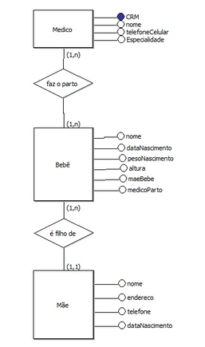
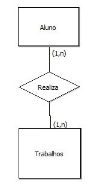
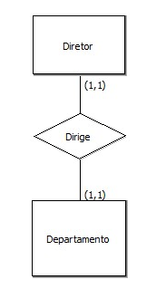
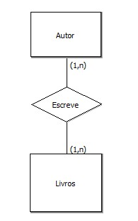
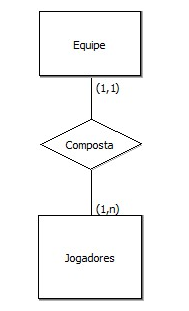
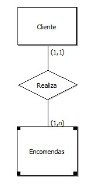
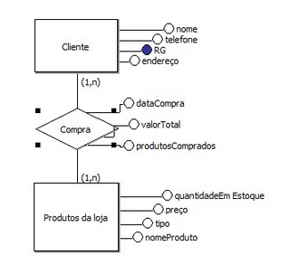
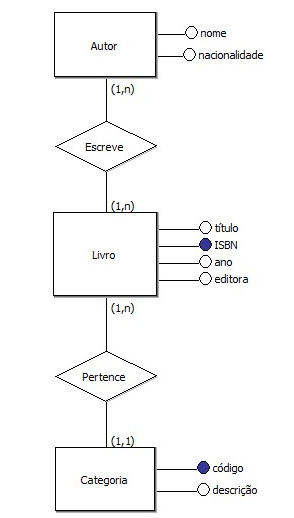
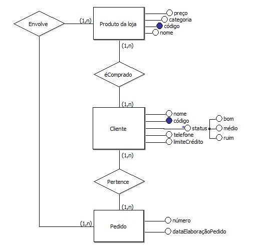

<h1 align="center"><u> Atividade 1 </u></h1>

***Primeira Lista de Exercícios de Banco de Dados***\
***Valor: 2 pts***\
***Data de Entrega: 02/06/2022***\
***Nome:*** Davi Kalel Andrade Teixeira 

<ol>
    <li>Um berçário deseja informatizar suas operações. Quando um bebê nasce, algumas informações são armazenadas sobre ele, tais como: nome, data do nascimento, peso do nascimento, altura, a mãe deste bebê e o médico que fez seu parto. Para as mães, o berçário também deseja manter um controle, guardando informações como: nome, endereço, telefone e data de nascimento. Para os médicos, é importante saber: CRM, nome, telefone celular e especialidade.
    </li>
    <ol type="a">
        <b><li>
            Identifique as entidades no texto acima.
        </li></b>
        <i>Entidades:</i> Bebê, Mãe e Médico.  
        <b><li>
            Liste os relacionamentos entre as entidades. Exemplo; Mãe bebê: "é mãe de".
        </li></b>
        Médico -> Bebê: "faz o parto"  Bebê -> Mãe: "é filho de"
        <b><li>
            Crie o modelo Entidade Relacionamento.
        </li></b>
        </img>
    </ol>
    <li>
        Desenhe as entidades e os relacionamentos (com devidas cardinalidades) mencionados abaixo. Obs: as entidades não precisam ter atributos somente a representação nos relacionamentos e suas cardinalidades.
    </li>
    <ol type="a">
        <b><li>
            Um aluno realiza vários trabalhos. Um trabalho é realizado por um ou mais alunos.
        </li></b>
        
        <b><li>
            Um diretor dirige nomáximo um departamento. Um departamento tem no máximo um diretor.
        </li></b>
        
        <b><li>
            Um  autor escreve vários livros. Um livro pode ser escrito por vários autores.
        </li></b>
        
        <b><li>
        Uma equipe é composta por vários jogadores. Um jogador joga apenas em uma equipe.
        </li></b>
        
        <b><li>
        Um cliente realiza várias encomendas. Uma encomenda diz respeito apenas a um cliente.
        </li></b>
        
    </ol>
    <li>Uma floricultura deseja informatizar suas operações. Inicialmente, deseja manter um cadastro de todos os seus clientes, mantendo informações como: RG, nome, telefone e endereço. Deseja também manter um cadastro contendo informações sobre os produtos que vende, tais como: nome do produto, tipo (flor, vaso, planta,...), preço e quantidade em estoque. Quando um cliente faz uma compra, a mesma é armazenada mantendo informação sobre o cliente que fez a compra, a data da compra, o valor total e os produtos comprados. Crie o modelo Entidade Relacionamento.</li>
    
    <li>
        Uma biblioteca deseja manter informações sobre seus livros. Inicialmente, quer armazenar para os livros as seguintes características: ISBN, título, ano editora e autores deste livro. Para os autores, deseja manter: nome e nacionalidade. Cabe salientar que um autor pode ter vários livros, assim como um livro pode ser escrito por vários autores. Cada livro da biblioteca pertence a uma categoria. A biblioteca deseja manter um cadastro de todas as categorias existentes, com informações como: código da categoria e descrição. Uma categoria pode ter vários livros associados a ela.Crie o modelo Entidade Relacionamento.
    </li>
    
    <li>
        Uma firma vende produtos de limpeza, e deseja melhor controlar os produtos que vende, seus clientes e os pedidos. Cada produto é caracterizado por um código, nome do produto, categoria (ex. detergente, sabão em pó, sabonete, etc), e seu preço. A categoria é uma classificação criada pela própria firma. A firma possui informações sobre todos seus clientes. Cada cliente é identificado por um código, nome, endereço, telefone, status ("bom", "médio", "ruim"), e o seu limite de crédito. Guarda-se igualmente a informação dos pedidos feitos pelos clientes. Cada pedido possui um número e guarda-se a data de elaboração do pedido. Cada pedido pode envolver de um a vários produtos, e para cada produto, indica-se a quantidade deste pedida.
    </li>
    
</ol>

